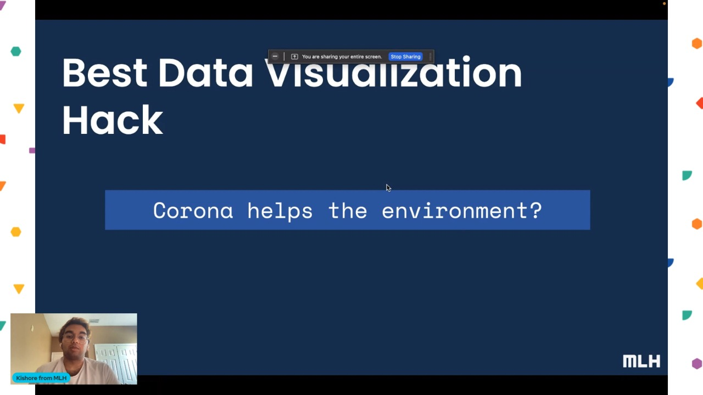

# Dataday Grind III — India Air Quality, Pre vs Post COVID

> **Winner: Best Data Visualisation Hack at Dataday Grind III by MLH.**




[Watch the demo on YouTube](https://youtu.be/Kz0wZPgQxYc)

## About

- **What:** A data-mining and visualization notebook that interrogates India's Air Quality Index across cities and time, comparing pre-COVID and post-COVID readings.
- **Who:** Gyanesh Samanta and Praveen Kumar K.
- **When:** Hackathon weekend, July 23–25, 2022.
- **Where:** Submitted to **Dataday Grind III**, an MLH-affiliated data hackathon.
- **Why:** Air pollution is one of India's most measurable yet under-discussed crises. The pandemic created a natural experiment — fewer cars, fewer factories — and we wanted to see what the AQI numbers actually said about it.

## The Story

In March 2020, India locked down. Roads emptied. Skies, in many cities, visibly cleared — Punjab residents reported seeing the Himalayas for the first time in decades. We wanted to know if the data backed up the anecdotes, and what happened once the lockdowns lifted.

We pulled the `air_quality_index.csv` dataset of city-by-city AQI readings and went to work. The notebook walks through cleaning, exploration, and a series of visualisations comparing AQI distributions pre-COVID versus post-COVID, surfacing which cities saw the biggest drops, which rebounded fastest, and how festival seasons (especially Diwali fireworks) punch through any baseline gains.

We didn't get to ship the predictive piece — entering a city name and forecasting next-month AQI — but the visual evidence stands on its own and is what won us the data viz prize that weekend.

---

## Tech Stack

- **Language:** Python 3
- **Notebook:** Jupyter (Anaconda distribution)
- **Libraries:** pandas, numpy, matplotlib, seaborn
- **Video editing:** DaVinci Resolve 16 (for the demo)

## Repo Structure

```
Dataday-Grind-III/
├── Dataset/
│   └── air_quality_index.csv     # India AQI readings, multi-city, multi-year
├── Notebook.ipynb                # End-to-end mining + viz notebook
└── Repository-Assests/
    └── Winner.jpeg
```

## Getting Started

```bash
git clone https://github.com/GyaneshSamanta/Dataday-Grind-III.git
cd Dataday-Grind-III

conda create -n aqi python=3.10 pandas numpy matplotlib seaborn jupyter
conda activate aqi
jupyter notebook Notebook.ipynb
```

Run the cells top-to-bottom — the dataset is bundled in `Dataset/`.

## Contributing

The roadmap item we never finished: take a city name as input and forecast AQI over the next few months. PRs that pick up that thread are welcome.

## License

No explicit license; treat as source-available for educational reference.

## Credits

| Name | GitHub |
| :--- | :----- |
| Gyanesh Samanta | [@GyaneshSamanta](https://github.com/GyaneshSamanta) |
| Praveen Kumar K | [@Pravi16](https://github.com/Pravi16) |

Hackathon hosted by Major League Hacking (MLH) — Dataday Grind III, 2022.
